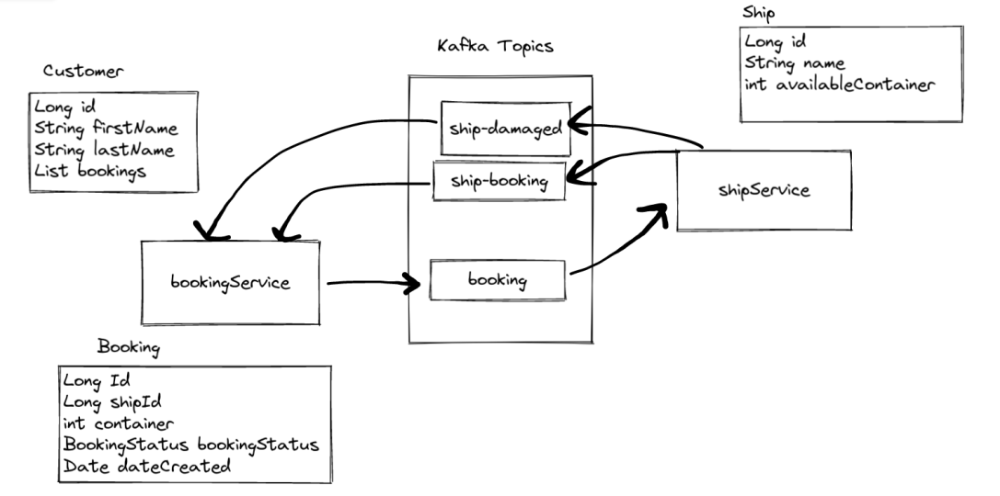

### Table of Contents
## Abstract
A short summary (less than 100 words) that describe the core elements of the problem and its solution.

What is solved (Short problemstatement)
Which environment
What tools are used
Why should you use this solution? What are the key benefits?

## Introduction and goals

Goal: The application should show how spring-kafka can be implemented within a sample application to leverage Apache Kafka's functionalities.

## Context and scope
Everything that relates to the design decision of the solution

Non-functional requirements that are defined and that lead to this solution

Given tools that are set and cannot be changed: Spring-kafka, Spring-boot, Apache Kafka

This application is not depended on the cloud vendor and the cloud strategy...

Technology stack (when of interest for the solution)
Java, Postman, Lombok, Docker, JUnit

## Solution Strategy
https://docs.arc42.org/section-4/

Describe the solution.
technology decisions
decisions about the top-level decomposition of the system, e.g. usage of an architectural pattern or design pattern
decisions on how to achieve key quality goals
relevant organizational decisions, e.g. selecting a development process or delegating certain tasks to third parties.
Use one or more images to give an overview of the architecture of the solution
What tools are used and how do they work together
Highlight in a short sentence the use of each tool
Use links to the tools and description. Do not describe each tool with your own words.

## Constraints and Alternatives
What are the constraints of this solution
What points need an architect to have a look on
Where are the limits?
What alternatives exist on the marked. Why have they not been considered. <- Only links and a short sentence. This is not the main focus!

## Concrete Steps to create the solution

# Kafka

This sample application demonstrates a ship booking service. Customers can book ships and multiple customers can book the same ships. The bookings can then be confirmed. Bookings can be cancelled by shipDamagedEvents that can be sent and received through kafka. The user is also able to see the booking status (PENDING, CONFIRMED, CANCELLED).

The usage of this application can be visualized through the following use case:

shipDamagedEvents will be sent to the topic "shipDamagedTopic" defined with spring-kafka to the kafka message broker. Application receives the shipDamagedEvents through the kafka message broker. This changes the booking status of the bookings with the damaged ship defined by shipDamagedEvents to "CANCELLED".

The bookingService has two entities. The first one is "Customer" and the other one is "Booking". A customer can create bookings for ships and some of their containers. The bookings are saved in form of a list inside the Customer entity.

When the booking is created for the first time, the booking status will be set to PENDING. Immediately after the creation, the booking will be sent to the booking topic. The shipService listens on the booking topic, ready to consume the incoming booking. The consummed booking will be checked for the available container. If the ship has enough available containers, the ship service reduces the available containers of the ship and sends the confirmation to the ship-booking topic. In the other case, if the ship doesn't have enough available containers, then the ship service also sends the rejection to the ship-booking topic. The bookingService consumes these messages and at the end, the booking status gets changed to the appropriate booking status (CONFIRMED or DENIED).
